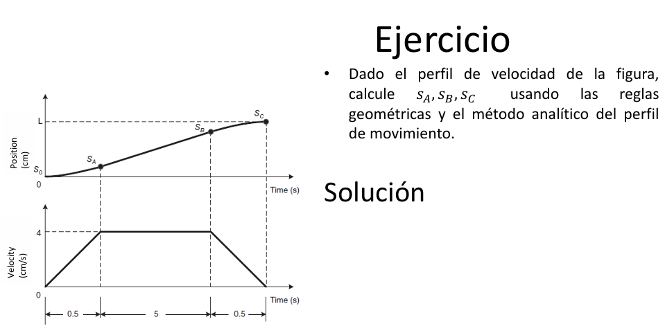
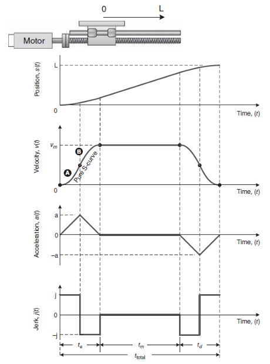

# CLASE-18-DE-MARZO Y CLASE-25-DE-MARZO

## Integrantes 
Carlos Stiven Guezguan         Codigo 96039                           
Juan Jose Martinez             Codigo 105353
## 1. Introducción

Es la seleccion seleccion de setpoint verificar que se cumplas los movimientos que se cumpla con respecto al tiempo, los perfiles de movimiento son funciones matemáticas que describen la evolución de las variables cinemáticas (posición, velocidad y aceleración) en función del tiempo dentro de un sistema de control. Estos perfiles son ampliamente utilizados en aplicaciones industriales como la robótica, máquinas CNC, impresión 3D y sistemas de transporte automatizado.

El objetivo principal del diseño de un perfil de movimiento es garantizar un desplazamiento eficiente minimizando vibraciones, esfuerzos mecánicos y tiempos de respuesta.

## 2. Clasificación de los Perfiles de Movimiento

Un perfil de movimiento se define cómo deben cambiar la posición a a b, velocidad y aceleración de un sistema durante un trayecto, permitiendo movimientos suaves, precisos y dentro de los límites físicos del sistema. Se usa para evitar esfuerzos mecánicos, mejorar la eficiencia y facilitar el control. Los más comunes son el trapezoidal (acelera, velocidad constante y desacelera) y el S-curve (suaviza la aceleración para evitar cambios bruscos) tambien es muy importante tener la cinematica del sistema puesto no ayuda a entender ya que permite calcular cómo se moverá un objeto en el espacio en función del tiempo..

### 2.1 Perfil Trapezoidal

El perfil de velocidad trapezoidal es una de las estrategias más comunes en el control de movimiento. Su característica principal es que la velocidad presenta tres fases bien definidas:

1. **Fase de aceleración constante:** La velocidad aumenta linealmente con una aceleración constante *a*, hasta alcanzar un valor máximo *v_max*.

2. **Fase de velocidad constante:** La velocidad se mantiene en *v_max* durante un período de tiempo determinado.

3. **Fase de desaceleración constante:** La velocidad disminuye linealmente con una aceleración negativa hasta detenerse o alcanzar el punto final.

### Cálculo del perfil trapezoidal

Dado un desplazamiento total *s*, una aceleración máxima *a*, y una velocidad máxima *v_max*, las ecuaciones del perfil se definen como:

* **Tiempo de aceleración:**

    ta = v_max / a

* **Distancia recorrida en la fase de aceleración:**

    sa = (1/2) * a * ta^2 = v_max^2 / (2 * a)

* **Tiempo en velocidad constante:**

    tc = (s - 2 * sa) / v_max

* **Tiempo total del movimiento:**

    ttotal = ta + tc + td = 2 * ta + tc

Si el desplazamiento *s* no es suficiente para alcanzar la velocidad máxima *v_max*, se genera un perfil triangular, donde el sistema acelera hasta un cierto punto y luego desacelera sin una fase de velocidad constante.

* **Aplicaciones del perfil trapezoidal:**

    * Máquinas CNC y sistemas de manufactura automatizada.
    * Brazos robóticos en procesos de ensamblaje.
    * Sistemas de elevación y transporte de cargas.

### 2.2 Perfil en "S" (Polinómico de Orden Superior)

El perfil de velocidad en "S" es una extensión del perfil trapezoidal que suaviza las transiciones entre fases, evitando cambios abruptos en la aceleración (jerk). Esto se logra mediante la interpolación de funciones polinómicas o sigmoides en las transiciones.
Donde *t_total* es el tiempo total de movimiento. Este método proporciona una aceleración continua y diferenciable, reduciendo esfuerzos mecánicos y mejorando la estabilidad del sistema.

* **Aplicaciones del perfil en "S":**

    * Robots de alta precisión como brazos de ensamblaje en industria aeroespacial.
    * Sistemas de guiado de vehículos autónomos.
    * Máquinas CNC avanzadas que requieren transiciones suaves para evitar vibraciones.

## 3. Comparación entre Perfiles de Movimiento

| Característica        | Perfil Trapezoidal             | Perfil en "S"                     |
| :-------------------- | :----------------------------- | :-------------------------------- |
| Ecuación              | Lineal en cada fase            | Función polinómica                |
| Aceleración           | Discontinua                    | Suave y continua                  |
| Vibraciones           | Puede generar picos de fuerza | Minimiza esfuerzos mecánicos      |
| Tiempo de respuesta  | Más corto                      | Más largo pero con mejor estabilidad |
| Aplicaciones          | Movimiento rápido y eficiente  | Procesos de alta precisión        |

# Ejemplo de Cálculo para un Sistema de Movimiento

Se desea mover un actuador lineal una distancia de 2 metros con un perfil trapezoidal. Se conocen los siguientes parámetros:

* **Velocidad máxima:** $v_{max} = 1 \, \text{m/s}$
* **Aceleración máxima:** $a = 2 \, \text{m/s}^2$

## Cálculo del tiempo de aceleración:

$t_a = \frac{v_{max}}{a} = \frac{1}{2} = 0.5 \, \text{s}$

## Distancia recorrida durante la aceleración:

$s_a = \frac{1}{2} a t_a^2 = \frac{1}{2} (2) (0.5)^2 = 0.25 \, \text{m}$

## Cálculo del tiempo en velocidad constante:

$s_c = s - 2s_a = 2 - 2(0.25) = 1.5 \, \text{m}$

$t_c = \frac{s_c}{v_{max}} = \frac{1.5}{1} = 1.5 \, \text{s}$

## Tiempo total de movimiento:

$t_{total} = t_a + t_c + t_a = 0.5 + 1.5 + 0.5 = 2.5 \, \text{s}$

Este análisis permite determinar si el sistema cumple con las especificaciones de diseño y optimizar su desempeño.

# 5. Ejercicio propuesto por el profesor 

## Ejercicio 1

Datos:

* Fase de aceleración: $t_A = 0.5 \, \text{s}$
* Fase de velocidad constante: $t_B = 5 \, \text{s}$
* Fase de desaceleración: $t_C = 0.5 \, \text{s}$
* Velocidad máxima: $v_{max}$ (no se especifica, lo dejaremos como variable)
* Aceleración y desaceleración constantes (pendientes de los tramos)

## Cálculo de las distancias recorridas en cada fase:

## 1. Fase de aceleración ($S_A$)

Se usa la ecuación de movimiento uniformemente acelerado:

$S_A = \frac{1}{2} v_{max} t_A$

Sustituyendo los valores:

$S_A = \frac{1}{2} v_{max} (0.5)$

$S_A = 0.25 v_{max}$

## 2. Fase de velocidad constante ($S_B$)

Movimiento rectilíneo uniforme:

$S_B = v_{max} t_B$

$S_B = v_{max} (5) = 5 v_{max}$

## 3. Fase de desaceleración ($S_C$)

Simétrica a la fase de aceleración, por lo que:

$S_C = S_A = 0.25 v_{max}$

## Ejercicio 2

Para calcular la ecuación de velocidad $v(t)$ utilizando tres puntos de la curva, tomaremos tres instantes clave en la fase de aceleración:

1. $t = 0$
2. $t = t_a/4$
3. $t = t_a/2$ (este ya fue utilizado en la ecuación de la imagen)

Sabemos que la velocidad en función del tiempo se modela como un polinomio cuadrático:

$v(t) = C_1 t^2 + C_2 t + C_3$

**Paso 1: Condiciones Iniciales**

1. En $t = 0$, la velocidad es cero:

$v(0) = C_1 (0)^2 + C_2 (0) + C_3 = 0$

Conclusión: $C_3 = 0$

2. En $t = t_a/2$, se usa la ecuación dada en la imagen:

$v(t_a/2) = C_1 (t_a/2)^2 = v_m/2$

Conclusión: $C_1 = \frac{2v_m}{t_a^2}$

**Paso 2: Cálculo del tercer punto**

Usamos $t = t_a/4$ para validar el modelo:

$v(t_a/4) = C_1 (t_a/4)^2$

Sustituyendo $C_1 = \frac{2v_m}{t_a^2}$:

$v(t_a/4) = \frac{2v_m}{t_a^2} \cdot \left(\frac{t_a}{4}\right)^2$

$v(t_a/4) = \frac{2v_m}{t_a^2} \cdot \frac{t_a^2}{16} = \frac{2v_m}{16} = \frac{v_m}{8}$

**Resultado:**

* En $t = 0$, $v(0) = 0$
* En $t = t_a/4$, $v(t_a/4) = v_m/8$
* En $t = t_a/2$, $v(t_a/2) = v_m/2$

Esto confirma que la ecuación $v(t) = \frac{2v_m}{t_a^2} t^2$ es correcta en estos tres puntos.

# 6. Ejercicio propuesto

## Ejemplo 1: Perfil Trapezoidal en un Actuador Lineal

 Un actuador lineal debe mover una carga 2 metros con un perfil trapezoidal. Se conocen los siguientes parámetros:

* **Velocidad máxima:** $v_{max} = 1.5 \, \text{m/s}$
* **Aceleración máxima:** $a = 3 \, \text{m/s}^2$

## Calcular el tiempo de aceleración

El tiempo necesario para alcanzar la velocidad máxima viene dado por la ecuación de la cinemática:

$t_a = \frac{v_{max}}{a}$

Sustituyendo los valores:

$t_a = \frac{1.5}{3} = 0.5 \, \text{s}$

## Determinar la distancia recorrida durante la aceleración

La distancia recorrida en la fase de aceleración se obtiene de la ecuación:

$s_a = \frac{1}{2} a t_a^2$

Sustituyendo los valores:

$s_a = \frac{1}{2} (3) (0.5)^2 = 0.375 \, \text{m}$

## Calcular la distancia recorrida en la fase de velocidad constante

La distancia total que debe recorrer el actuador es 2 m, por lo que la distancia recorrida en la fase de velocidad constante es:

$s_c = s - 2s_a$

Sustituyendo los valores:

$s_c = 2 - 2(0.375) = 1.25 \, \text{m}$

## Determinar el tiempo en velocidad constante

La velocidad en esta fase es constante, por lo que el tiempo necesario se calcula con la ecuación:

$t_c = \frac{s_c}{v_{max}}$

Sustituyendo los valores:

$t_c = \frac{1.25}{1.5} \approx 0.83 \, \text{s}$

## Calcular el tiempo total de movimiento

El tiempo total de movimiento se obtiene sumando todas las fases:

$t_{total} = t_a + t_c + t_a$

Sustituyendo los valores:

$t_{total} = 0.5 + 0.83 + 0.5 = 1.83 \, \text{s}$

## Ejemplo 2: Perfil en "S" en un Robot Industrial

 Un brazo robótico debe mover su efector final desde el punto A al punto B utilizando un perfil de velocidad en "S" para reducir esfuerzos mecánicos. Se conocen los siguientes parámetros:

* **Tiempo total de movimiento:** $t_{total} = 3 \, \text{s}$
* **Velocidad máxima:** $v_{max} = 2 \, \text{m/s}$
* **Aceleración máxima:** $a = 4 \, \text{m/s}^2$

En este caso, se usa una interpolación polinómica para suavizar la aceleración. Una función comúnmente utilizada es:

$v(t) = v_{max} \cdot \frac{1 - \cos(\pi t / t_{total})}{2}$

## Calcular la velocidad en distintos instantes de tiempo

Sustituyamos los valores de $t$ en la ecuación:

| Tiempo (s) | Velocidad (m/s) |
|------------|-----------------|
| 0.0        | 0.00            |
| 0.5        | 0.48            |
| 1.0        | 1.00            |
| 1.5        | 1.52            |
| 2.0        | 1.90            |
| 2.5        | 2.00            |
| 3.0        | 0.00            |

El perfil en "S" permite una transición suave en la aceleración y desaceleración, reduciendo impactos mecánicos en el sistema.
 
# 7. Conclusión

El diseño de perfiles de movimiento es una parte fundamental en sistemas de control de movimiento. La selección del perfil adecuado depende de los requerimientos de velocidad, precisión y estabilidad. Mientras que el perfil trapezoidal es eficiente y fácil de implementar, el perfil en "S" proporciona un comportamiento más suave y es preferido en aplicaciones de alta precisión.

El análisis matemático de los perfiles permite calcular con precisión los tiempos y distancias requeridas, asegurando que el sistema opere de manera óptima dentro de sus limitaciones mecánicas y dinámicas.
